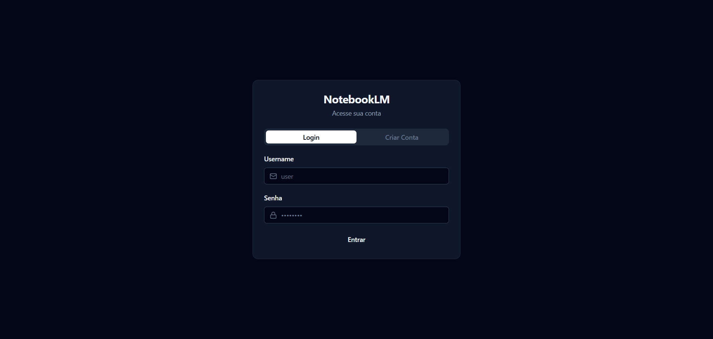
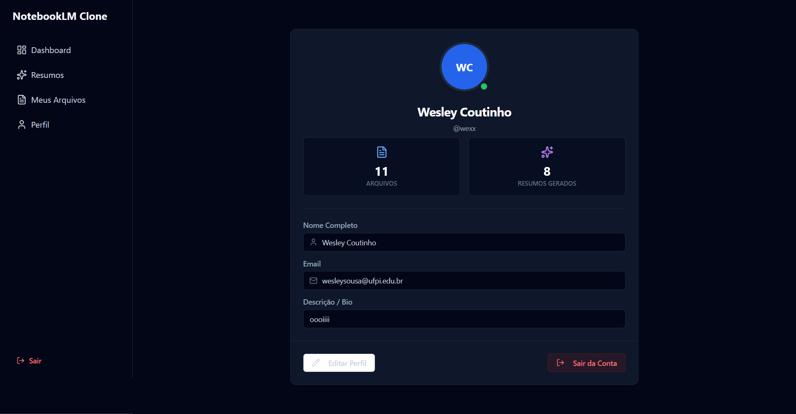
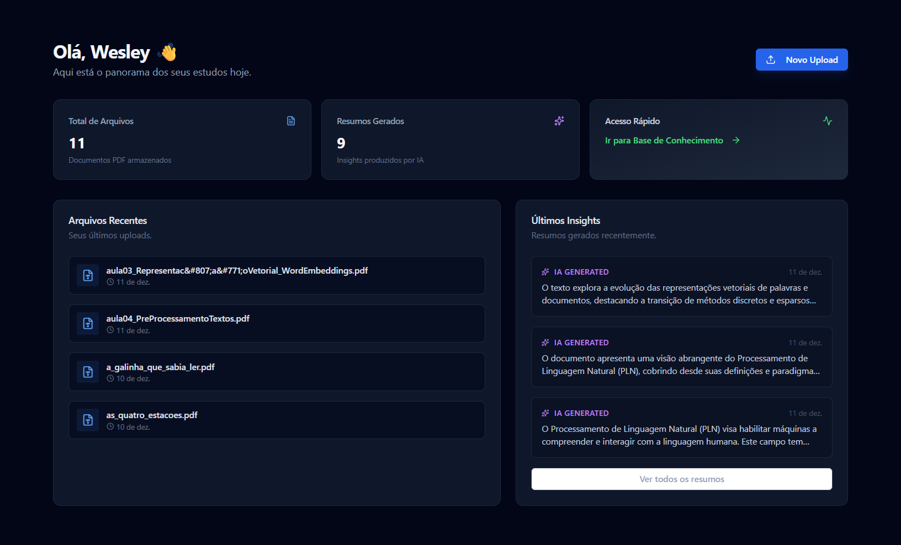
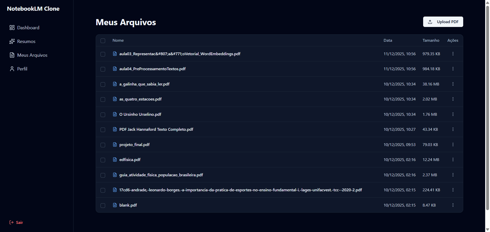
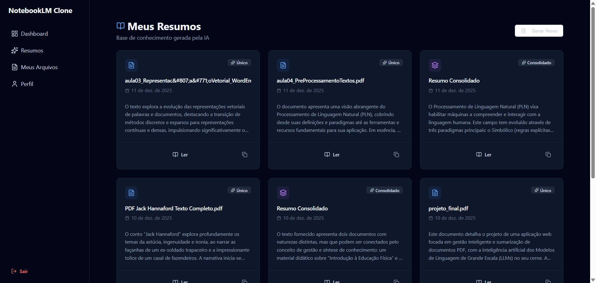
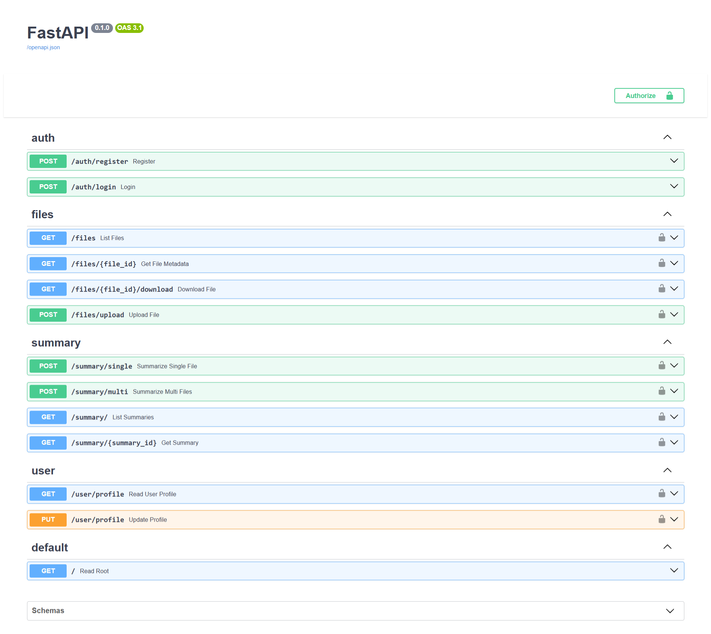

# 📚 NotebookLM Clone - Assistente de Estudo com IA


Este projeto é uma plataforma web desenvolvida como Trabalho de Conclusão de Disciplina (Tópicos de Computação Avançada). O sistema permite o upload de documentos PDF, gerenciamento de arquivos e geração de resumos inteligentes (individuais ou consolidados) utilizando Inteligência Artificial Generativa (LLM).

> ⚠️ **Contexto de Desenvolvimento (MVP Acadêmico)**
>
> Este projeto foi desenvolvido dentro de um *timebox* acadêmico restrito. Para garantir a entrega de um **MVP (Produto Mínimo Viável)** funcional e robusto, algumas decisões de arquitetura priorizaram a agilidade e a redução de custos de infraestrutura:
>
> 1.  **Persistência de Arquivos:** Optamos pelo uso de **Volumes Docker** (armazenamento em disco na EC2) em vez de serviços de Object Storage (como AWS S3), simplificando a camada de infraestrutura sem comprometer a funcionalidade de upload.
> 2.  **Rede:** A aplicação opera em uma arquitetura simplificada de VPC, focando a segurança nas regras de **Security Groups** e no isolamento de containers via Docker Network, em vez de subnets privadas com NAT Gateways complexos.
>
> O foco principal deste trabalho foi demonstrar a **integração bem-sucedida de Microsserviços, Containerização (Docker), Deploy Cloud e Inteligência Artificial Generativa**.

---

## 🚀 Funcionalidades Principais

### 🔐 Autenticação e Perfil
- Sistema completo de **Login e Registro** (JWT Authentication).
- Gestão de perfil com edição de dados.
- Segurança de rotas (Middleware de proteção).

### 📂 Gestão de Arquivos
- **Upload de PDFs** (limite de 50MB).
- Listagem, visualização e download de arquivos.
- Armazenamento persistente utilizando Volumes Docker.

### 🧠 Inteligência Artificial (LLM)
- **Resumo Individual:** Gera uma análise detalhada de um único documento.
- **Resumo Consolidado:** Seleciona múltiplos arquivos para criar um resumo unificado relacionando os conteúdos.
- Integração com **gemini-2.5-flash** para processamento de linguagem natural.

### 📊 Dashboard
- Visão geral de estatísticas (Total de arquivos, resumos gerados).
- Acesso rápido aos últimos documentos e insights.

---

## 📸 Screenshots

Aqui está uma visão geral das funcionalidades do sistema em funcionamento na AWS.

### 1. Autenticação e Perfil
O sistema conta com login seguro (JWT) e personalização de perfil com upload de imagem.

| Tela de Login | Edição de Perfil |
|:---:|:---:|
|  |  |

### 2. Dashboard e Upload
Visão geral das estatísticas e área para envio de documentos PDF com persistência de dados.



### 3. Geração de Resumos (IA)
Integração com o Google Gemini para gerar insights rápidos sobre os documentos.

| Upload de Arquivo | Resumo Gerado |
|:---:|:---:|
|  |  |

### 4. Documentação da API (Swagger UI)
O Backend FastAPI gera automaticamente uma documentação interativa, permitindo testar rotas e visualizar esquemas de dados.




## 🏗️ Arquitetura do Sistema

O projeto utiliza uma arquitetura baseada em microsserviços containerizados, facilitando a escalabilidade e o deploy.

### Diagrama de Comunicação
```mermaid
graph TD
    User((Usuário))
    Browser[Navegador / Frontend React]
    LB[AWS / Nginx Reverse Proxy]
    API[Backend FastAPI]
    DB[(PostgreSQL)]
    LLM[Google Gemini API]
    Storage[File Storage / Volume]

    User -->|Acessa HTTP:80| Browser
    Browser -->|Requisição API HTTP:8000| API
    
    subgraph Docker Network
        API -->|Lê/Escreve Dados| DB
        API -->|Salva PDF/Img| Storage
    end
    
    API -->|Envia Contexto + Prompt| LLM
    LLM -->|Retorna Resumo| API
````

### Stack Tecnológica

| Camada | Tecnologia | Descrição |
| :--- | :--- | :--- |
| **Frontend** | React + Vite | Interface SPA moderna e responsiva. |
| **Estilização** | TailwindCSS + Shadcn/UI | Componentes visuais acessíveis e elegantes. |
| **Backend** | Python + FastAPI | API REST performática e assíncrona. |
| **Banco de Dados** | PostgreSQL | Persistência de dados relacionais. |
| **ORM** | SQLAlchemy + Alembic | Modelagem de dados e migrações. |
| **Infraestrutura** | Docker Compose | Orquestração dos containers. |
| **Deploy** | AWS EC2 (Ubuntu) | Hospedagem em nuvem. |

-----

## 🔧 Pré-requisitos

Para rodar localmente, você precisa ter instalado:

  - [Docker](https://www.docker.com/) e Docker Compose.
  - Git.

-----

## ⚡ Como Rodar Localmente (Passo a Passo)

1.  **Clone o repositório**

    ```bash
    git clone [https://github.com/emerymoriconi/notebook-lm.git](https://github.com/emerymoriconi/notebook-lm.git)
    cd notebook-lm
    ```

2.  **Configure as Variáveis de Ambiente**
    Crie um arquivo `.env` na raiz do projeto:

    ```env
    # .env
    POSTGRES_USER=usuario
    POSTGRES_PASSWORD=senha
    POSTGRES_DB=notebook_db

    # Configurações Locais
    VITE_API_URL=http://localhost:8000
    FRONTEND_URL=http://localhost:5173
    ```

    *Nota: O Backend possui um `.env` próprio (`backend/.env`) onde devem estar as chaves secretas (`SECRET_KEY`, `GEMINI_API_KEY`).*

3.  **Inicie a Aplicação**

    ```bash
    docker-compose up -d --build
    ```

4.  **Acesse**
      - Frontend: `http://localhost:5173`
      - Documentação API (Swagger): `http://localhost:8000/docs`

-----

## ☁️ Deploy na AWS

O projeto está configurado para um deploy híbrido e seguro na AWS:

1.  **Backend:** A imagem é baixada pré-compilada do **Docker Hub** para agilidade.
2.  **Frontend:** É compilado **dentro da instância AWS** para garantir que as variáveis de ambiente (IP da API) sejam injetadas corretamente.

Para detalhes completos de como subir a instância, configurar o Security Group e rodar o projeto em produção, consulte o guia dedicado:

👉 **[GUIA DE DEPLOY AWS (DEPLOY\_AWS.md)](https://www.google.com/search?q=./DEPLOY_AWS.md)**

-----

## 👥 Equipe

Projeto desenvolvido por:

  - **[Wesley de Sousa Coutinho]**
  - **[Émery Moriconi Freitas]**

-----

## 📄 Licença

Este projeto está sob a licença MIT. Veja o arquivo [LICENSE](https://www.google.com/search?q=LICENSE) para mais detalhes.

````
